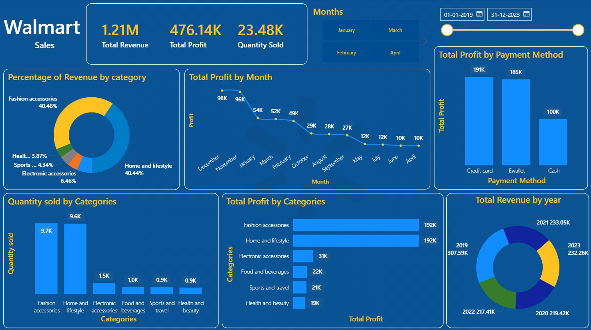

# 🛒 Walmart Sales Analysis | Python, SQL & Power BI

## 📌 Project Overview
This project analyzes Walmart sales data using **Python for data cleaning & feature engineering**, **MySQL for analytical querying**, and **Power BI for interactive dashboard visualization**.  
The goal is to transform raw transactional data into a structured dataset and extract business insights related to revenue, profit, customer behavior, and sales trends.

---

## 🧰 Tools & Technologies
- **Python** (Pandas, NumPy, Matplotlib)
- **MySQL**
- **Power BI**
- **Jupyter Notebook**
- **SQLAlchemy**

---

## 📂 Dataset Description
The dataset contains **10,051 Walmart sales transactions** with the following attributes:

- Invoice ID
- Branch
- City
- Product Category
- Unit Price
- Quantity
- Date & Time
- Payment Method
- Customer Rating
- Profit Margin

---

## 🐍 Python: Data Cleaning & Feature Engineering

### 1️⃣ Data Loading & Inspection
- Loaded CSV file using Pandas
- Checked dataset shape, data types, and memory usage
- Generated descriptive statistics for numerical columns

### 2️⃣ Handling Missing & Duplicate Values
- Removed rows with missing values
- Identified and removed duplicate records

### 3️⃣ Data Cleaning
- Removed currency symbol (`$`) from `unit_price`
- Converted `unit_price` to numeric format

### 4️⃣ Feature Engineering
Created new calculated columns:
- **Total Sales** = unit_price × quantity
- **Profit** = total × profit_margin
- **Cost** = total − profit
- Extracted:
  - Hour from time
  - Year, Month, Month Name
  - Weekday name
  - ISO week number

### 5️⃣ Rating Segmentation
- Grouped customer ratings into:
  - Low
  - Medium
  - High

### 6️⃣ Final Dataset
- Rounded financial columns
- Exported cleaned dataset as `Walmart_clean.csv`

---

## 🗄 MySQL: Data Storage & Analysis

### Database Setup
- Created MySQL database `walmart_project`
- Loaded cleaned data into table `walmart_sales` using SQLAlchemy

---

### 📊 Business Questions Answered Using SQL

#### Sales & Revenue Analysis
- Total revenue and profit by branch and city
- Revenue contribution by product category
- Monthly, weekly, and yearly sales trends
- Average Order Value (AOV) by branch and payment method
- Weekend vs weekday sales performance

#### Customer & Payment Insights
- Revenue and profit by payment method
- Most preferred payment method
- Average ratings by category and payment method
- Rating-wise revenue and profit contribution

#### Product & Category Performance
- Most profitable category
- Most sold category by quantity
- Profit margin by category
- Categories contributing to 80% of total revenue
- Categories with high sales but low profit margins

#### Advanced Analysis
- Peak sales hour by branch
- Top 3 revenue-generating categories per city
- High-value transactions identification
- Month-over-Month (MoM) sales growth
- Year-over-Year (YoY) sales growth
- Profit efficiency ranking of branches

---

## 📈 Power BI Dashboard

An interactive Power BI dashboard was created to visualize key metrics:

### Dashboard Highlights
- **Total Revenue, Total Profit, Quantity Sold**
- Revenue share by category
- Profit trends by month
- Revenue and profit by payment method
- Quantity sold by category
- Profit by category
- Year-wise revenue distribution
- Date & month slicers for dynamic filtering

📸 **Dashboard Preview:**  

---

## 📁 Project Structure
Walmart-Sales-Analysis
│
├── walmart.csv
├── Walmart Project.ipynb
├── Walmart_clean.csv
├── walmart_project_eda.sql
├── walmart_dashboard.jpg
├── README.md
